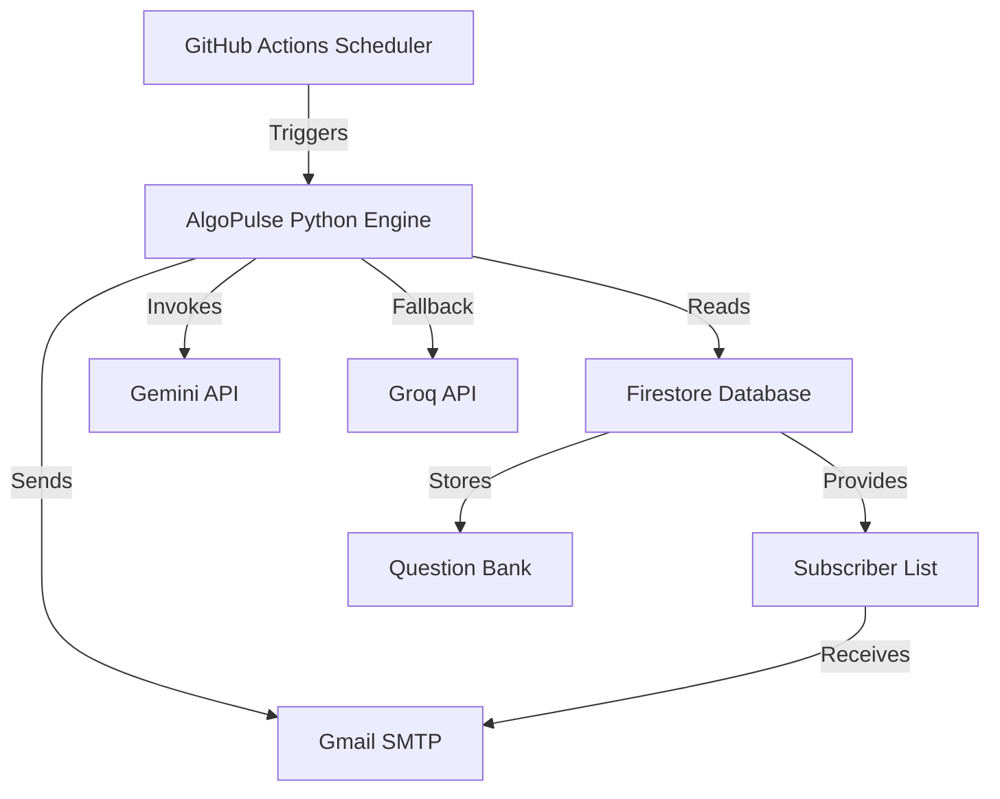
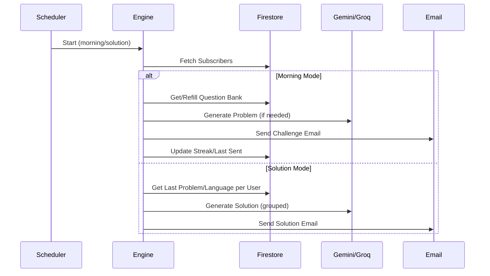

# AlgoPulse ✨ Project README

AlgoPulse is an automated engine for delivering daily LeetCode data structures and algorithms (DSA) challenges and their solutions to subscribers. This documentation covers all code, configuration, and infrastructure files in the repository, describing their role and mechanics.

---

## `daily_question.py`

This file is the **core automation engine** for AlgoPulse. It orchestrates challenge & solution dispatch, manages the Firestore question bank, integrates AI for problem/solution generation, and handles email notifications.

### Main Responsibilities

- **Firebase Initialization**: Authenticates and provides access to Firestore for state and question management.
- **AI Problem/Solution Generation**: Leverages Gemini and Groq APIs to generate challenges and solutions.
- **Question Bank Management**: Ensures a pool of problems for each topic/difficulty, auto-refilling as needed.
- **Subscriber Management**: Fetches all active users and tracks their preferences and progress.
- **Email Dispatch**: Sends morning challenges and evening solutions using Gmail SMTP.
- **Dual Mode Operation**: Runs in "morning" (problem dispatch) or "solution" (solution dispatch) mode, triggered by schedule or manually.

### Detailed Functionality

#### Configuration and Initialization

- Reads sensitive configuration (API keys, email credentials, Firebase service account) from environment variables.
- Initializes Firebase Admin SDK with the provided service account for secure Firestore access.

#### AI Integration

- `call_ai(prompt, is_json=True)`: 
  - Sends a prompt to Gemini (primary) or Groq (fallback) for either JSON or raw text responses.
  - Used for both generating new problems and solving existing ones.

#### Question Bank Workflow

- `refill_question_bank(topic, difficulty)`:
  - If the bank is empty for a topic/difficulty, calls AI to generate 10 new questions and stores them in Firestore.
- `get_morning_problem(topic, difficulty)`:
  - Fetches an unused problem for a given topic/difficulty. If none exist, triggers a refill.

#### Email Formatting and Sending

- `send_morning_challenge(user, problem_json)`:
  - Styles and dispatches the morning challenge email with problem details, constraints, and a LeetCode link.
- `send_evening_solution(user, problem_data, solution_code)`:
  - Sends a formatted solution to the challenge in the user's chosen programming language.
- `dispatch_email(to, subject, body)`:
  - Handles the SMTP logic for secured email sending.

#### Main Execution Logic

- **Mode Selection**: Determines whether to run "morning" or "solution" logic, via `--mode` argument.
- **Morning Mode**:
  - Fetches all active subscribers.
  - For each unique (topic, difficulty) pair, retrieves or generates a problem.
  - Sends each subscriber their personalized problem and updates their streak.
- **Solution Mode**:
  - Groups users by the specific problem and language.
  - For each group, generates a solution via AI and sends it to each user.

### Data Flow Diagram



### Firestore Structure

- `artifacts/{APP_ID}/public/data/subscribers`  
  - Documents with subscriber info (email, topic, difficulty, language, streak, status).
- `artifacts/{APP_ID}/public/data/question_bank`  
  - Documents containing problem data, topic, difficulty, usage flag, etc.

### Key Functions (Table)

| Function                | Purpose                                                             |
|-------------------------|---------------------------------------------------------------------|
| `call_ai`               | Calls Gemini (or Groq) to generate problems/solutions.              |
| `refill_question_bank`  | Populates question bank via AI if empty for topic/difficulty.       |
| `get_morning_problem`   | Fetches one unused problem, triggers refill if needed.              |
| `send_morning_challenge`| Composes and sends challenge email to user.                         |
| `send_evening_solution` | Sends solution email with AI-generated code.                        |
| `dispatch_email`        | Handles SMTP for all outbound emails.                               |

### Mode Workflow Sequence



---

## `readme.md`

This file is the **project overview and onboarding guide** for AlgoPulse. It explains the system’s philosophy, technical stack, workflow, and setup instructions.

### Main Sections

- **Mission Statement**: Outlines AlgoPulse's goal to promote consistent, daily DSA learning.
- **Daily Rhythm**: Describes the 7 AM challenge and 8 PM solution cycle.
- **Technical Architecture**: Lists the serverless, cloud-based components.
- **System Workflow**: Presents step-by-step operation from trigger to dispatch.
- **Installation & Deployment**: Details how to set up Firebase, configure secrets, and deploy using GitHub Actions.
- **Author**: Credits the creator.

### Technology Table

| Component    | Technology      | Role                                  |
|--------------|----------------|---------------------------------------|
| The Brain    | Python 3.11     | Dual-dispatch logic, AI integration   |
| Database     | Firebase Firestore | User state & question bank         |
| Orchestrator | GitHub Actions  | Cron scheduling, automation           |
| AI Layer     | Gemini 2.0 Flash| Problem & solution generation         |
| Interface    | Tailwind CSS    | Dashboard                            |

### Setup Checklist

- **Firebase**: Enable authentication, database, and service accounts.
- **GitHub Secrets**: Store all sensitive keys and config as repo secrets.
- **Deployment**: Automatic from the main branch.

---

## `daily_automation.yml`

This is the **GitHub Actions workflow** file that fully automates AlgoPulse’s daily operation and deployment.

### Trigger Configuration

- **Schedule (Cron)**:
  - 7:00 AM IST: Sends morning challenge (`cron: '30 1 * * *'`)
  - 8:00 PM IST: Sends evening solution (`cron: '30 14 * * *'`)
- **Manual**: Via GitHub Actions workflow dispatch, supporting mode selection.

### Workflow Jobs

- **run-bot**:  
  - Checks out code, installs Python 3.11 and dependencies.
  - Exposes required secrets as environment variables.
  - Determines mode (morning/solution) from manual input or UTC hour.
  - Runs the engine via `python daily_question.py --mode $MODE`.

- **deploy-dashboard**:  
  - Waits for run-bot.
  - Injects frontend Firebase config into `index.html`.
  - Configures and deploys GitHub Pages for the dashboard.

### Workflow (Table)

| Step                  | Description                                         |
|-----------------------|-----------------------------------------------------|
| Checkout              | Grabs the repo code                                 |
| Setup Python          | Ensures Python 3.11 environment                     |
| Install Dependencies  | Installs all packages from `requirements.txt`        |
| Set Env Variables     | Loads secrets for AI, email, Firebase               |
| Run Engine            | Executes daily engine in chosen mode                |
| Firebase Config Inject| Patches frontend config before deploy                |
| Deploy Pages          | Publishes dashboard                                 |

---

## `index.html`

This file is the **public dashboard** for AlgoPulse, letting users enroll, manage subscriptions, and view network stats.

### Main Features

- **Modern UI**: Uses Tailwind CSS and Lucide icons for a sleek, responsive layout.
- **Enroll Tab**: 
  - Select topic, difficulty, language.
  - Email input for subscription.
  - On submit, creates a new subscription in Firestore.
- **Manage Tab**: 
  - Look up subscription by email.
  - View streak, track, and cancel enrollment.
- **Network Size**: 
  - Real-time count of active users, updated via Firestore snapshot.
- **Firebase JS SDK**: 
  - Dynamically injected config for secure, client-side Firestore access.
- **UX Feedback**: 
  - Loading, error, and success indications.

### UI Structure

| Section      | Description                                   |
|--------------|-----------------------------------------------|
| Header       | Branding, status indicator, navigation tabs   |
| Enroll Main  | Topic, difficulty, language, email form       |
| Manage Main  | Subscription lookup, streak display, cancel   |
| Footer       | Author credit                                 |

### Real-Time Operations

- **User Count**: Displays live number of subscribers.
- **Anonymous Auth**: Uses Firebase anonymous login for security.

### Example: Subscribing a User

```js
await db.collection('artifacts').doc(APP_ID)
    .collection('public').doc('data')
    .collection('subscribers').add({
        email, topic, difficulty, language, streak: 0, status: 'active', createdAt: firebase.firestore.FieldValue.serverTimestamp()
    });
```

### Example: Lookup

```js
const snap = await db.collection('artifacts').doc(APP_ID)
    .collection('public').doc('data')
    .collection('subscribers')
    .where('email', '==', email).get();
```

---

## `requirements.txt`

This file lists the **Python dependencies** required to run AlgoPulse’s automation engine.

```txt
requests
firebase-admin
```

- **requests**: Used for HTTP requests to AI APIs (Gemini, Groq).
- **firebase-admin**: For secure server-side access to Firebase services.

---

# API Endpoints

## Firestore-Based Endpoints

While AlgoPulse does not expose traditional REST endpoints from the Python backend, the frontend interacts with Firestore collections directly via the Firebase JS SDK. Below are the main operations as API blocks for clarity.

### 1. Subscribe (Add New Subscriber)

#### API: Add Subscriber

```api
{
    "title": "Subscribe to Daily Challenge",
    "description": "Creates a new subscription for daily DSA problems and solutions.",
    "method": "POST",
    "baseUrl": "https://firestore.googleapis.com",
    "endpoint": "/v1/projects/[project_id]/databases/(default)/documents/artifacts/algopulse-v1/public/data/subscribers",
    "headers": [],
    "queryParams": [],
    "pathParams": [],
    "bodyType": "json",
    "requestBody": "{\n  \"fields\": {\n    \"email\": {\"stringValue\": \"dev@example.com\"},\n    \"topic\": {\"stringValue\": \"LogicBuilding\"},\n    \"difficulty\": {\"stringValue\": \"Medium\"},\n    \"language\": {\"stringValue\": \"Python\"},\n    \"streak\": {\"integerValue\": \"0\"},\n    \"status\": {\"stringValue\": \"active\"},\n    \"createdAt\": {\"timestampValue\": \"2024-06-10T09:00:00Z\"}\n  }\n}",
    "formData": [],
    "responses": {
        "200": {
            "description": "Subscription created",
            "body": "{\n  \"name\": \"projects/[project_id]/databases/(default)/documents/artifacts/algopulse-v1/public/data/subscribers/[doc_id]\"\n}"
        }
    }
}
```

### 2. Lookup Subscription

```api
{
    "title": "Lookup Subscription",
    "description": "Retrieves a subscriber record by email.",
    "method": "GET",
    "baseUrl": "https://firestore.googleapis.com",
    "endpoint": "/v1/projects/[project_id]/databases/(default)/documents:runQuery",
    "headers": [],
    "queryParams": [],
    "pathParams": [],
    "bodyType": "json",
    "requestBody": "{\n  \"structuredQuery\": {\n    \"from\": [{\"collectionId\": \"subscribers\"}],\n    \"where\": {\n      \"fieldFilter\": {\n        \"field\": {\"fieldPath\": \"email\"},\n        \"op\": \"EQUAL\",\n        \"value\": {\"stringValue\": \"dev@example.com\"}\n      }\n    }\n  }\n}",
    "formData": [],
    "responses": {
        "200": {
            "description": "Subscriber record found",
            "body": "{\n  \"document\": {\n     \"fields\": { ... }\n  }\n}"
        },
        "404": {
            "description": "Not Found",
            "body": "{\n  \"error\": { \"message\": \"No record found\" }\n}"
        }
    }
}
```

### 3. Cancel Subscription

```api
{
    "title": "Cancel Subscription",
    "description": "Deletes a subscriber document by ID.",
    "method": "DELETE",
    "baseUrl": "https://firestore.googleapis.com",
    "endpoint": "/v1/projects/[project_id]/databases/(default)/documents/artifacts/algopulse-v1/public/data/subscribers/[doc_id]",
    "headers": [],
    "queryParams": [],
    "pathParams": [
        {
            "key": "doc_id",
            "value": "The Firestore document ID of the subscriber",
            "required": true
        }
    ],
    "bodyType": "none",
    "requestBody": "",
    "formData": [],
    "responses": {
        "200": {
            "description": "Subscription deleted",
            "body": "{}"
        }
    }
}
```

---

# Key Behavioral Notes

```card
{
    "title": "Zero-Op Serverless Automation",
    "content": "AlgoPulse operates fully serverlessly using GitHub Actions, requiring no persistent backend server."
}
```

```card
{
    "title": "Companion AI Integration",
    "content": "Problem and solution generation leverages Gemini 2.0 Flash with Groq as seamless fallback."
}
```

```card
{
    "title": "Personalized Learning Cycle",
    "content": "Each user gets challenge and solution matched to their language, topic, and difficulty."
}
```

---

# Summary

AlgoPulse integrates Python, Firebase, AI APIs, and GitHub Actions to provide a reliable, automated daily DSA learning cycle. Its codebase features robust automation, real-time UI, and serverless deployment, maximizing learning consistency for all subscribers.
